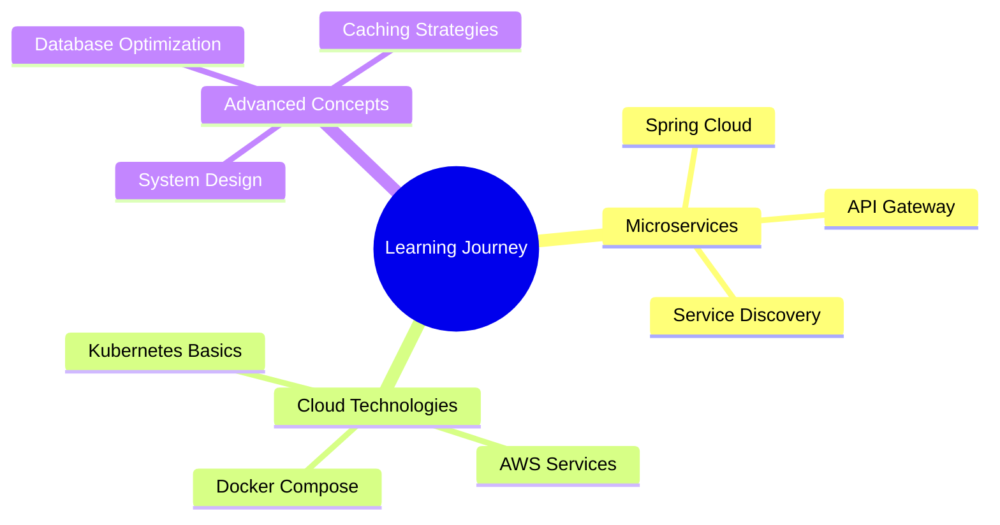

<div align="center">


<h1>
  
</h1>

<p align="center">
  
  
  
</p>

<div align="center">
  
[](https://portfoliowebsite-two-beige.vercel.app)
[](mailto:rohanjangid631@gmail.com)
[](https://www.linkedin.com/in/rohan-jangid-a54b68229/)
[](https://portfoliowebsite-two-beige.vercel.app)

</div>

</div>

---

<div align="center">

## 🌟 Welcome to My Digital Universe


</div>

```javascript
const rohan = {
    pronouns: "He" | "Him",
    location: "Faridabad, India 🇮🇳",
    education: "Computer Engineering Graduate 🎓",
    currentStatus: "Seeking Full-time Opportunities",
    
    expertise: {
        backend: ["Java", "Python", "Spring Boot", "Django"],
        frontend: ["React", "JavaScript", "HTML5", "CSS3"],
        databases: ["PostgreSQL", "MySQL"],
        tools: ["Docker", "Git", "Postman", "VS Code"],
        architecture: ["REST APIs", "Microservices", "MVC"]
    },
    
    currentFocus: "Building scalable backend systems",
    funFact: "I can debug code faster than I can make coffee ☕",
    
    motto: "Clean Code, Better Solutions, Endless Learning 🚀"
};
```

<br clear="right"/>

---

## 🎯 Professional Journey

<div align="center">

### 🏢 **Current Status: Ready for New Challenges!**


</div>

---

## 🛠️ Technology Ecosystem

<details open>
<summary><b>🔥 Core Technologies & Tools</b></summary>
<br>

<div align="center">

### **Programming Languages**
<p>
  
</p>

### **Frameworks & Libraries**
<p>
  
</p>

### **Databases & Cloud**
<p>
  
</p>

### **Development Tools**
<p>
  
</p>

### **Web Technologies**
<p>
  
</p>

</div>

</details>

---

## 🚀 Professional Experience & Projects

<div align="center">

### 💼 **U4RAD Technology | Software Development Intern**
*Jan 2025 – July 2025*

</div>

<table>
<tr>
<td width="50%" valign="top">

### 🏥 **Healthcare Solutions**
- **🔄 DICOM Automation Suite**
  - [`Orthanc Job Monitor`](https://github.com/rjangid631/U4rad-Orthanc-Job-Monitor-.git) - Automated DICOM uploads
  - [`Web Upload Platform`](https://github.com/rjangid631/U4RAD_DICOM_UPLOAD_PROJECT.git) - React-based file manager
  
- **🏕️ Camp Management System**
  - [`Camp Automation`](https://github.com/rjangid631/campautomation.git) - Complete health camp solution
  - Real-time dashboards & analytics

**Tech Stack:** `Python` `Django` `React` `PostgreSQL`

</td>
<td width="50%" valign="top">

### 🎯 **Enterprise Tools**
- **🧾 IT Service Management**
  - [`Help Desk System`](https://github.com/rjangid631/HelpDesk.git) - Ticketing & workflow optimization
  - Role-based access control
  
- **📱 Digital Forms & QR Integration**
  - Medical data collection systems
  - ECG dashboard enhancements
  - Mobile-responsive interfaces

**Tech Stack:** `Django REST` `Bootstrap` `JavaScript` `MySQL`

</td>
</tr>
</table>

---

## 📊 GitHub Analytics & Insights

<div align="center">


<br><br>


</div>

---

## 🏆 Achievements & Recognition

<div align="center">


</div>

---

## 📈 Contribution Activity

<div align="center">


</div>

---

## 🎯 What I Bring to Your Team

<div align="center">

<table>
<tr>
<td align="center" width="33%">

<h3>🔧 Technical Excellence</h3>
<p><em>Clean, scalable code with best practices</em></p>
</td>
<td align="center" width="33%">

<h3>🤝 Team Collaboration</h3>
<p><em>Effective communication & project delivery</em></p>
</td>
<td align="center" width="33%">

<h3>💡 Problem Solving</h3>
<p><em>Creative solutions for complex challenges</em></p>
</td>
</tr>
</table>

</div>

---

## 🌱 Currently Learning & Exploring

<div align="center">



</div>

---

## 📝 Latest Blog Posts & Insights

<!-- BLOG-POST-LIST:START -->
<div align="center">
<table>
<tr>
<td width="50%">

### 📚 **Technical Articles**
- Building Scalable REST APIs with Spring Boot
- Django Best Practices for Enterprise Applications
- Database Optimization Techniques

</td>
<td width="50%">

### 🎯 **Project Case Studies**
- DICOM File Processing at Scale
- Healthcare Management System Architecture
- Real-time Dashboard Implementation

</td>
</tr>
</table>
</div>
<!-- BLOG-POST-LIST:END -->

---

## 🎨 Fun Zone

<div align="center">

### 🎵 **Coding Playlist**
*What I listen to while coding:*


### ☕ **Coffee Counter**
*Cups of coffee consumed while coding this month:*


### 🎯 **Current Mood**


</div>

---

## 🤝 Let's Connect & Collaborate

<div align="center">

### 💼 **Ready to work together? Let's make something amazing!**

<table>
<tr>
<td align="center" width="25%">
<a href="https://portfoliowebsite-two-beige.vercel.app">

<br><sub><b>View My Work</b></sub>
</a>
</td>
<td align="center" width="25%">
<a href="mailto:rohanjangid631@gmail.com">

<br><sub><b>Direct Contact</b></sub>
</a>
</td>
<td align="center" width="25%">
<a href="https://www.linkedin.com/in/rohan-jangid-a54b68229/">

<br><sub><b>Professional Profile</b></sub>
</a>
</td>
<td align="center" width="25%">
<a href="https://portfoliowebsite-two-beige.vercel.app">

<br><sub><b>My CV</b></sub>
</a>
</td>
</tr>
</table>

<br>

### 📬 **Open for:**
- 💼 **Full-time Backend/Full Stack Developer positions**
- 🤝 **Freelance & Contract opportunities**  
- 💡 **Collaborative projects & open source contributions**
- 🎓 **Mentoring & knowledge sharing**

<br>


</div>

---

<div align="center">


<br><br>


<br>


</div>
