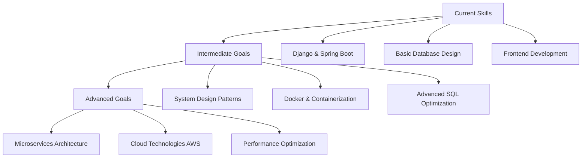

<div align="center">


<h1>
  
</h1>

<p align="center">
  
  
  
</p>

<div align="center">
  
[](https://portfoliowebsite-two-beige.vercel.app)
[](mailto:rohanjangid631@gmail.com)
[](https://www.linkedin.com/in/rohan-jangid-a54b68229/)

</div>

</div>

---

<div align="center">

## 🌟 About Me


</div>

```javascript
const rohan = {
    currentRole: "Software Developer at U4RAD Technology",
    experience: "6 months internship + Current full-time role",
    education: "Computer Engineering Graduate (SPPU)",
    location: "Faridabad, India 🇮🇳",
    
    techStack: {
        comfortable: ["Java", "Python", "JavaScript"],
        frameworks: ["Django", "Spring Boot", "React"],
        databases: ["PostgreSQL", "MySQL"],
        tools: ["Git", "VS Code", "Postman", "Docker (learning)"]
    },
    
    currentFocus: [
        "Building healthcare solutions",
        "Learning system design patterns",
        "Improving code quality & best practices"
    ],
    
    personalGrowth: "From intern to developer in 6 months! 📈",
    motto: "Every day is a learning opportunity 🌱"
};
```

<br clear="right"/>

---

## 🎯 My Professional Journey

<div align="center">

### 📈 **Growth Timeline**


</div>

---

## 🛠️ Technologies I Work With

<div align="center">

### **Languages I'm Comfortable With**
<p>
  
</p>

### **Frameworks & Tools I Use**
<p>
  
</p>

### **Databases & Development Tools**
<p>
  
</p>

### **Currently Learning**
<p>
  
  
</p>

</div>

---

## 🚀 My Work at U4RAD Technology

<div align="center">

### 💼 **Software Developer** *(July 2025 - Present)*
### 🎓 **Software Development Intern** *(Jan 2025 - July 2025)*

</div>

<table>
<tr>
<td width="50%" valign="top">

### 🏥 **Healthcare Solutions**

**🔄 DICOM File Management**
- [`Automated Upload Tool`](https://github.com/rjangid631/U4rad-Orthanc-Job-Monitor-.git)
  - Python-based automation for medical files
  - Integrated with Orthanc PACS system
  
- [`Web Upload Platform`](https://github.com/rjangid631/U4RAD_DICOM_UPLOAD_PROJECT.git)
  - Django + React file management system
  - Drag-and-drop interface with progress tracking

**Tech Used:** `Python` `Django` `React` `REST APIs`

</td>
<td width="50%" valign="top">

### 🎯 **Management Systems**

**🏕️ Camp Automation**
- [`Health Camp Management`](https://github.com/rjangid631/campautomation.git)
  - Complete camp scheduling and tracking
  - Dashboard with data visualization
  
**🧾 IT Support System**
- [`Help Desk Platform`](https://github.com/rjangid631/HelpDesk.git)
  - Ticket management and workflow optimization
  - User role management

**Tech Used:** `Django` `PostgreSQL` `JavaScript` `Bootstrap`

</td>
</tr>
</table>

### 📱 **Additional Projects**
- **QR Code Forms** - Digitized medical data collection (Google Forms alternative)
- **ECG Dashboard** - Enhanced UI for health camp reporting
- **Database Optimization** - Improved query performance for existing systems

---

## 📊 GitHub Activity

<div align="center">


<br><br>


</div>

---

## 🌱 What I'm Learning & Improving

<div align="center">

<table>
<tr>
<td align="center" width="33%">

<h3>🔧 Code Quality</h3>
<p><em>Writing cleaner, more maintainable code</em></p>
</td>
<td align="center" width="33%">

<h3>🏗️ System Design</h3>
<p><em>Understanding scalable architecture patterns</em></p>
</td>
<td align="center" width="33%">

<h3>🌐 API Development</h3>
<p><em>Building robust RESTful services</em></p>
</td>
</tr>
</table>

</div>

---

## 📈 My Learning Goals

<div align="center">



</div>

---

## 🏆 My Growth Milestones

<div align="center">


### **Professional Achievements**
- ✅ Successfully completed 6-month internship
- ✅ Promoted to full-time Software Developer
- ✅ Delivered 6+ production-ready projects
- ✅ Working with real healthcare systems
- 🎯 Building expertise in backend development

</div>

---

## 💭 What I Bring as a Junior Developer

<div align="center">

<table>
<tr>
<td align="center" width="25%">
<h4>🧠 <b>Quick Learner</b></h4>
<p><em>From intern to developer in 6 months</em></p>
</td>
<td align="center" width="25%">
<h4>🎯 <b>Problem Solver</b></h4>
<p><em>Built solutions for real healthcare challenges</em></p>
</td>
<td align="center" width="25%">
<h4>📚 <b>Growth Mindset</b></h4>
<p><em>Always eager to learn new technologies</em></p>
</td>
<td align="center" width="25%">
<h4>🤝 <b>Team Player</b></h4>
<p><em>Collaborative approach to development</em></p>
</td>
</tr>
</table>

</div>

---

## 🎯 Current Focus Areas

<div align="center">

### 📖 **What I'm Working On**


### 🎓 **Resources I'm Using**
- System Design Interview Books
- Docker & Kubernetes Tutorials  
- AWS Free Tier Exploration
- Clean Code Practices
- Database Optimization Techniques

</div>

---

## 🤝 Let's Connect!

<div align="center">

### 💼 **I'm interested in:**

<table>
<tr>
<td align="center" width="33%">
<h4>🌟 <b>Learning Opportunities</b></h4>
<p><em>Mentorship & knowledge sharing</em></p>
</td>
<td align="center" width="33%">
<h4>🤝 <b>Collaboration</b></h4>
<p><em>Working on interesting projects</em></p>
</td>
<td align="center" width="33%">
<h4>💡 <b>Tech Discussions</b></h4>
<p><em>Sharing experiences & best practices</em></p>
</td>
</tr>
</table>

<br>

<table>
<tr>
<td align="center" width="33%">
<a href="https://portfoliowebsite-two-beige.vercel.app">

<br><sub><b>My Projects</b></sub>
</a>
</td>
<td align="center" width="33%">
<a href="mailto:rohanjangid631@gmail.com">

<br><sub><b>Get In Touch</b></sub>
</a>
</td>
<td align="center" width="33%">
<a href="https://www.linkedin.com/in/rohan-jangid-a54b68229/">

<br><sub><b>Network</b></sub>
</a>
</td>
</tr>
</table>

<br>


</div>

---

<div align="center">


<br>


</div>
